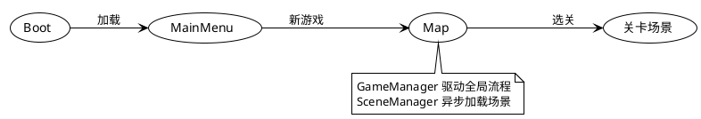
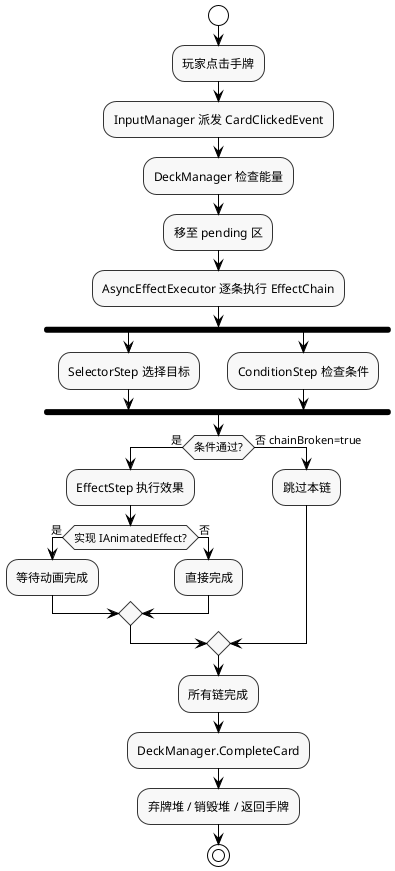
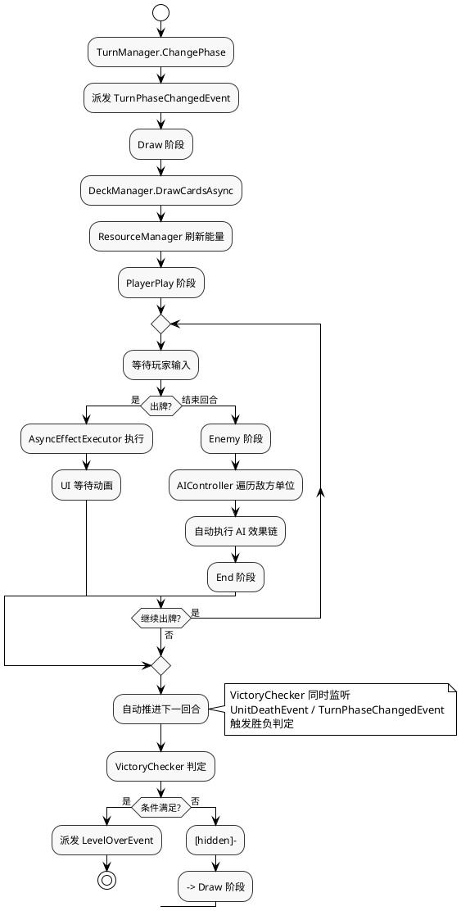

# CardChess 架构文档

> 最后更新：2026-06-15 | 作者：WoodenLove

## 目录

- [一、概览与术语](#一概览与术语)
- [二、整体架构图](#二整体架构图)
- [三、模块职责一览](#三模块职责一览)
- [三、模块职责一览](#三模块职责一览)
- [四、系统组合视角](#四系统组合视角)
- [五、核心数据流](#五核心数据流)
- [六、技术选型与约束](#六技术选型与约束)
- [七、持久化与配置管理](#七持久化与配置管理)
- [八、跨模块设计决策记录](#八跨模块设计决策记录)
- [九、非功能性需求概要](#九非功能性需求概要)
- [十、里程碑与时间表](#十里程碑与时间表)

## 一、概览与术语

### 游戏类型

CardChess 是一款回合制卡牌战棋策略游戏。玩家在棋盘关卡中操控己方单位，通过打出手牌触发移动、攻击、治疗、Buff 等效果链，与敌方单位进行战斗。项目采用 ECS 架构，将卡牌、单位、关卡、AI 行为、地形和胜利条件配置为 ScriptableObject 资产，运行时由管理器加载并驱动表现。

整体流程：启动引导 → 主菜单 → 新游戏 → 地图选关 → 回合战斗 → 胜负结算。关卡由 Tilemap 编辑器绘制，再通过提取管线生成为运行时资产，实现编辑与运行阶段解耦。

### 开发环境

| 项目 | 内容 |
|---|---|
| 游戏引擎 | Unity 2022.3.30f1c1 |
| 开发语言 | C# |
| 主要技术 | ScriptableObject、Addressables、Tilemap、New Input System、UGUI、TextMeshPro、DOTween |
| 主要场景 | `Boot`、`MainMenu`、`Map`、`Levels/LevelHome` |

### 关键术语

| 术语 | 说明 |
|------|------|
| 效果链（EffectChain） | 卡牌或 AI 行为的基本执行单元，由选择器→条件→效果三步组成 |
| 选择器（Selector） | 从场上单位或格子中选择目标的逻辑组件 |
| 修饰器（Modifier） | 对单位基础属性的运行时修正值，与基础值分离管理 |
| PinBoard | PreviewManager 采用的"先钉选再确认"的目标选择交互模式 |
| 回合状态机 | Start → Draw → PlayerPlay → PlayerAction → Enemy → End 的回合推进流程 |
| Tilemap 提取管线 | 从 Tilemap 场景一键提取为 ScriptableObject 资产的编辑器工具链 |

## 二、整体架构图

### 分层架构

```text
┌───────────────────────────────────────────────────────────────┐
│                       🎨 表现层                                │
│  ┌────────────────┐ ┌────────────────┐ ┌──────────────────┐    │
│  │  棋盘可视化     │ │  单位可视化     │ │  卡牌可视化       │    │
│  │GridVisualizer  │ │UnitAppearance  │ │CardVisualizer    │    │
│  │PathRenderer    │ │UnitVisualizer  │ │                  │    │
│  │GridHighlighter │ │Billboard       │ │                  │    │
│  │                │ │AnimEventFwd    │ │                  │    │
│  ├────────────────┤ ├────────────────┤ ├──────────────────┤    │
│  │  UI 面板管理    │ │  手牌 UI       │ │  浮层/特效        │    │
│  │UIManager       │ │HandUI          │ │FloatingNumMgr    │    │
│  │MainMenuUI      │ │                │ │ParticleManager   │    │
│  │HUD_UI          │ │                │ │                  │    │
│  │PauseMenuUI     │ │                │ │                  │    │
│  │SettingsUI      │ │                │ │                  │    │
│  │LoadingScreen   │ │                │ │                  │    │
│  │UnitInfoPanel   │ │                │ │                  │    │
│  └────────────────┘ └────────────────┘ └──────────────────┘    │
├────────────────────────────────────────────────────────────────┤
│                       🖱️ 交互层                                │
│  ┌────────────────┐ ┌────────────────┐ ┌──────────────────┐    │
│  │  输入管理       │ │  长按检测      │ │  预览交互         │    │
│  │InputManager    │ │LongPressDetect │ │PreviewManager    │    │
│  │ILongPressTarget│ │                │ │                  │    │
│  └────────────────┘ └────────────────┘ └──────────────────┘    │
├────────────────────────────────────────────────────────────────┤
│                       ⚙️ 逻辑层                                │
│  ┌──────────┐ ┌──────────┐ ┌──────────┐ ┌─────────────────┐    │
│  │ 回合管理  │ │ 效果链   │ │ AI 决策   │ │  棋盘逻辑       │    │
│  │TurnMgr   │ │EffectMgr │ │AICtrl    │ │GridManager      │    │
│  │TurnActEx │ │AsyncEffEx│ │AIDeck    │ │Cell             │    │
│  │ITurnState│ │EffectCtx │ │AIChain   │ │                 │    │
│  ├──────────┤ │EffectStep│ │          │ │                 │    │
│  │ 全局协调  │ │TargetSel │ │          │ │                 │    │
│  │GameMgr   │ │ITarget   │ │          │ │                 │    │
│  │LevelMgr  │ │Condition │ │          │ │                 │    │
│  │SaveMgr ⚠️│ │Effects   │ │          │ │                 │    │
│  └──────────┘ └──────────┘ └──────────┘ └─────────────────┘    │
│  ┌──────────┐ ┌──────────┐ ┌──────────┐ ┌──────────────────┐   │
│  │ 单位逻辑  │ │ 修饰器   │ │ Buff 管理 │ │  其他            │   │
│  │Unit      │ │Modifier  │ │BuffCntnr │ │VictoryChecker    │   │
│  │UnitFctry │ │ModifMgr  │ │Buff      │ │ResourceMgr ⚠️   │   │
│  │          │ │AttrCalc  │ │BuffInst  │ │DeckMgr ⚠️       │   │
│  │          │ │          │ │BuffIfaces│ │RunState          │   │
│  └──────────┘ └──────────┘ └──────────┘ └──────────────────┘   │
├────────────────────────────────────────────────────────────────┤
│                       📦 数据层                                │
│  ┌───────────┐ ┌──────────┐ ┌──────────┐ ┌──────────────────┐  │
│  │ 卡牌配置   │ │ 单位配置  │ │ AI 配置  │ │  关卡配置         │  │
│  │CardData   │ │UnitConfig│ │AIDeck    │ │LevelData         │  │
│  │CardColor  │ │AttrInit  │ │AIChain   │ │LevelGridData     │  │
│  │DestOnPlay │ │Occup/Fac │ │          │ │LevelTurnData     │  │
│  │           │ │DmgType   │ │          │ │CellData          │  │
│  ├───────────┤ │          │ │          │ │TerrainType       │  │
│  │ 游戏配置   │ │          │ │          │ │TerrainConfig     │  │
│  │RunConfig  │ │          │ │          │ ├──────────────────┤  │
│  │GameStart  │ │          │ │          │ │  胜利条件         │  │
│  │SpawnGroup │ │          │ │          │ │VictoryCondition  │  │
│  │RarityTier │ │          │ │          │ │KillAll/Survive…  │  │
│  │WeightEntry│ │          │ │          │ │CompositeCondition│  │
│  └───────────┘ └──────────┘ └──────────┘ └──────────────────┘  │
├────────────────────────────────────────────────────────────────┤
│                       🔧 基础层                                │
│  ┌────────────────┐ ┌────────────────┐                         │
│  │  事件总线       │ │  全局服务      │                         │
│  │GameEventChannel│ │AudioManager    │                         │
│  │ + 所有事件类型  │ │CameraController│                         │
│  │                │ │SceneManager    │                         │
│  │  日志          │ │Bootstrapper    │                         │
│  │Logger          │ │Initializer     │                         │
│  └────────────────┘ └────────────────┘                         │
└────────────────────────────────────────────────────────────────┘

⚠️ 标记说明：
  SaveManager    — 混合 PlayerPrefs(基础层) + JSON存档(逻辑层)，职责不单一
  ResourceManager — 管理资源数值(逻辑层)但耦合牌库/UI触发，边界模糊
  DeckManager    — 牌库逻辑(逻辑层)但含 pending 卡片视觉状态
  Unit           — 实现 ILongPressTarget(交互层接口)，跨层依赖
  PreviewManager — 介于交互层与表现层之间
```

### 模块依赖关系

- **事件总线**是唯一跨层基础设施：所有模块通过 `GameEventChannel` 解耦通信，不直接引用对方
- **效果链引擎**是逻辑层核心枢纽：`CardData` 和 `AIDeck` 都使用 `EffectChain` 表达行为，`Unit` 是效果的最终操作目标
- **数据层位于逻辑层之下**：运行时模块读取 ScriptableObject 但不修改它们（运行时状态在各自模块中维护）
- **表现层位于逻辑层之上**：表现组件（GridVisualizer/UnitAppearance/CardVisualizer）是逻辑模块的"视图"，通过事件或直接引用来同步
- **交互层连接表现与逻辑**：`InputManager` 将原生输入转为 GameEvent，`PreviewManager` 将玩家选择回传给 `AsyncEffectExecutor`

## 三、模块职责一览

> 以下按**分层**组织，每个模块 ≈ 一个代码文件或高内聚文件组。⚠️ 标记表示模块边界模糊，可能预示实现问题。

### 🎨 表现层

| 模块 | 负责 | 不负责 |
|------|------|--------|
| **棋盘可视化** (`GridVisualizer`) | 棋盘格子的视觉生成、高亮/还原、材质管理 | 网格数据结构、寻路算法 |
| **路径渲染** (`PathRenderer`) | 路径精灵的对象池管理和渲染 | 路径计算、格子占用判断 |
| **格子高亮** (`GridHighlighter`) | 格子高亮效果 | 目标选择逻辑 |
| **单位外观** (`UnitAppearance`) | 单位动画（行走/攻击/受击/死亡）、朝向、血条更新 | 单位属性逻辑、修饰器计算 |
| **单位视觉效果** (`UnitVisualizer`) | 单位悬停/高亮效果（2D/3D 材质切换） | 单位动画播放 |
| **卡牌可视化** (`CardVisualizer`) | 卡牌视觉呈现、悬停交互 | 牌库逻辑、效果执行 |
| **UI 面板管理** (`UIManager`+所有 Panel) | 面板显示/隐藏、遮罩转场、层级栈管理 | 游戏逻辑、回合推进 |
| **手牌 UI** (`HandUI`) | 手牌卡牌的对象池管理、抽牌/弃牌/能量动画 | 牌库数据结构 |
| **浮动数字** (`FloatingNumberManager`) | 伤害浮字显示 | 伤害计算 |
| **粒子特效** (`ParticleManager`) | 粒子效果播放 | 游戏逻辑 |

### 🖱️ 交互层

| 模块 | 负责 | 不负责 |
|------|------|--------|
| **输入管理** (`InputManager`) | 输入事件转换（单击/双击/右键/ESC/长按→GameEvent） | UI 布局、游戏逻辑 |
| **长按检测** (`LongPressInfoDetector`) | 长按手势识别与进度反馈 | 单位信息展示逻辑 |
| **预览交互** ⚠️ `PreviewManager` | PinBoard 目标选择交互、悬停预览、路径显示 | 效果执行、AI 自动选择 |

### ⚙️ 逻辑层

| 模块 | 负责 | 不负责 |
|------|------|--------|
| **回合管理** (`TurnManager`) | 状态机推进、阶段事件派发 | 卡牌效果执行、AI 决策 |
| **效果链引擎** (`EffectManager`+`AsyncEffectExecutor`+所有 Effect/Selector/Condition) | 效果链异步执行、多态步骤序列化、链中断机制、动画同步 | 回合流程、单位属性管理 |
| **AI 决策** (`AIController`) | 行为评分排序、`aiSelector` 自动目标选择 | 玩家输入、牌库管理 |
| **棋盘逻辑** (`GridManager`+`Cell`) | 二维网格构建、坐标转换、BFS 寻路、占用管理 | 视觉效果渲染 |
| **单位逻辑** (`Unit`+`UnitFactory`) | 属性管理、攻击方位判定、事件钩子 | AI 决策、网格管理 |
| **修饰器计算** (`ModifierManager`+`Modifier`+`AttributeCalculator`) | 属性修正值管理、计算公式 `(base_or×mult_or - base_ed×mult_ed)×finalMult + finalAdd` | Buff 生命周期 |
| **Buff 管理** (`BuffContainer`+`Buff`+`BuffInstance`+接口) | Buff 栈策略（Refresh/Overwrite/Separate）、接口事件转发 | 属性基础值管理 |
| **胜利判定** (`VictoryChecker`+`CompositeCondition`) | 条件组合树 AND/OR、事件监听、胜负事件派发 | 单位生成 |
| **全局协调** (`GameManager`) | 新游戏、关卡加载、暂停/返回、关卡结算 | 具体模块逻辑 |
| **关卡协调** (`LevelManager`) | 关卡初始化编排（网格/回合/单位/牌库/胜利条件） | 各子系统内部细节 |
| **资源管理** ⚠️ (`ResourceManager`) | 能量/金币管理 | 牌库具体逻辑、UI 刷新 |
| **牌库管理** ⚠️ (`DeckManager`) | 抽牌/弃牌/销毁/回手逻辑 | 卡牌视觉表现 |
| **存档管理** ⚠️ (`SaveManager`+`RunState`) | JSON 存档读写、运行状态维护 | 场景加载、PlayerPrefs 设置 |

### 📦 数据层

| 模块 | 负责 | 不负责 |
|------|------|--------|
| **卡牌数据** (`CardData`) | 卡牌名称/消耗/去向/颜色/效果链定义 | 牌库运行时状态 |
| **单位配置** (`UnitConfig`+`AttributeInitData`) | 单位属性预设、预制体引用、先天 Buff、AI 牌组 | 运行时属性变化 |
| **AI 配置** (`AIDeck`+`AIChainEntry`) | AI 候选行为、评分参数、策略类型 | AI 运行时决策 |
| **关卡数据** (`LevelData`+`LevelGridData`+`LevelTurnData`+`CellData`) | 关卡网格/回合预设/出生点/胜利条件 | 运行时关卡状态 |
| **地形配置** (`TerrainConfig`+`TerrainType`) | 地形属性定义 | 格子运行时占用 |
| **胜利条件定义** (`VictoryCondition`+具体条件+`ConditionTile`) | 胜利条件类型定义（全歼/坚守/保护/到达） | 运行时胜负判定 |
| **游戏配置** (`RunConfig`+`GameStartConfig`+`SpawnGroup`+`RarityTier`) | 难度曲线、初始阵容、刷怪组配置 | 运行时数值 |
| **回合行动定义** (`TurnAction` 子类) | 回合预设行动类型（刷怪/改地形/应用效果） | 行动执行顺序 |

### 🔧 基础层

| 模块 | 负责 | 不负责 |
|------|------|--------|
| **事件总线** (`GameEventChannel`+所有事件类型) | 泛型事件注册/注销/派发 | 事件处理逻辑 |
| **日志** (`Logger`) | 日志输出 | 日志存储 |
| **场景管理** (`SceneManager`) | 场景异步加载 | 关卡数据初始化 |
| **音频管理** (`AudioManager`) | 音效播放 | 游戏逻辑 |
| **摄像机** (`CameraController`) | 摄像机控制 | 输入处理 |
| **启动引导** (`Bootstrapper`+`Initializer`) | 全局 Manager 实例化、DontDestroyOnLoad、默认设置 | 场景内容加载 |

## 四、系统设计

> 系统 ≈ 按功能维度对模块的编排组合。系统视角关注"哪些模块协同完成一个功能"。

| 功能系统 | 涉及模块 | 说明 | 概览文档 |
|---------|---------|------|---------|
| **启动与加载系统** | `Bootstrapper` → `Initializer` → `SceneManager` → `GameManager` | 从游戏启动到主菜单的完整流程 | — |
| **回合战斗系统** | `TurnManager` → `DeckManager` → `AsyncEffectExecutor` → `AIController` → `VictoryChecker` | 回合状态机驱动整个战斗循环 | `system-overview/turn-combat-system.md` |
| **卡牌系统** | `CardVisualizer` → `HandUI` → `InputManager` → `DeckManager` → `AsyncEffectExecutor` → `PreviewManager` | 从玩家点牌到效果执行完毕 | `system-overview/card-system.md` |
| **关卡系统** | `LevelManager` → `GridManager` → `LevelTurnData` → `VictoryChecker` → `TurnManager` | 关卡初始化、运行到结束 | `system-overview/level-system.md` |
| **单位系统** | `Unit` + `UnitFactory` + `UnitAppearance` + `UnitVisualizer` + `ModifierManager` + `BuffContainer` | 单位的生命周期、属性、表现 | `system-overview/unit-system.md` |
| **AI 系统** | `AIController` → `AIDeck` → `AsyncEffectExecutor`（aiSelector 模式） | 敌方回合的决策与行动 | `system-overview/ai-system.md` |
| **UI 与交互系统** | `InputManager` + `UIManager` + `PreviewManager` + `FloatingNumberManager` + `ParticleManager` | 输入、面板、视觉反馈 | `system-overview/ui-interaction-system.md` |
| **存档与资源配置系统** | `ResourceManager` + `SaveManager` + `RunState` | 游戏状态持久化与运行中资源管理 | `system-overview/save-resource-system.md` |
| **编辑器工具系统** | 各编辑器工具 | Tilemap 提取管线、自定义 Inspector | `system-overview/editor-tools-system.md` |

## 五、核心数据流

### 场景流转



### 出牌与效果链时序



### 回合数据流



## 六、技术选型与约束

| 技术 | 用途 | 约束 |
|------|------|------|
| Unity 2022.3.30f1c1 | 游戏引擎 | LTS 版本，支持 `[SerializeReference]` 多态序列化 |
| ScriptableObject | 静态配置数据 | 不可跨场景持久化运行时状态；编辑器下创建，运行时只读 |
| Addressables | 资产异步加载 | 依赖 AssetBundle 构建流程；首次加载有延迟 |
| Tilemap | 关卡编辑工具 | 运行时卸载 Tilemap，仅使用提取后的数据资产 |
| New Input System | 输入抽象层 | 需要手动配置 Input Action Asset |
| UGUI + TextMeshPro | UI 系统 | 无特殊限制 |
| DOTween | 动画补间 | 轻量级，无特殊限制 |
| `[SerializeReference]` | 多态序列化 | Unity Inspector 原生支持有限，需自定义 PropertyDrawer（`ChainStepDrawer`） |

## 七、持久化与配置管理

### 配置资产体系

所有静态配置以 ScriptableObject 组织：

| 目录 | 资产类型 |
|------|---------|
| `Assets/ScriptableObjects/Cards/` | `CardData` |
| `Assets/ScriptableObjects/Units/` | `UnitConfig` |
| `Assets/ScriptableObjects/AI/` | `AIDeck` |
| `Assets/ScriptableObjects/Levels/` | `LevelData`、`LevelGridData`、`LevelTurnData` |
| `Assets/ScriptableObjects/Config/` | `RunConfig`、`GameStartConfig`、`SpawnGroup` |

### 存档结构

- **PlayerPrefs**：存储音量、分辨率等用户设置
- **JSON 存档**：写入可执行文件同级的 `Saves/` 目录
- **`RunState`**：内存中的运行状态对象，包含玩家阵容、金币、能量上限、卡牌地址、全局关卡索引和随机种子
- **演示存档**：`Saves/run.json`

## 八、跨模块设计决策记录

### 决策 1：`[SerializeReference]` 驱动的多态效果步骤

**决策**：使用 `[SerializeReference]` 在 `EffectChain.steps` 中直接序列化多态 `ChainStep` 子类，而非为每个步骤类型创建独立的 ScriptableObject。

**原因**：一张卡牌的一条效果链通常包含 2-5 个步骤，若每个步骤都是一个 ScriptableObject 资产，会导致大量零散资产文件，管理成本高。`[SerializeReference]` 将所有步骤内联在 `CardData` 资产中，配合自定义 `ChainStepDrawer` 在 Inspector 中直接选择子类创建实例，资产组织更紧凑，新增步骤类型也无需修改编辑器代码。

### 决策 2：Tilemap 提取管线

**决策**：编辑阶段使用 Tilemap 绘制关卡，运行时只加载提取后的 ScriptableObject 资产。

**原因**：Tilemap 是 Unity 内置的可视化编辑器，设计师可直接在场景中绘制地形和标记。但运行时加载 Tilemap 场景耦合高、性能开销大。通过提取管线（`Tools → Extract LevelData From Scene`）将 Tilemap 解析为纯数据资产，运行时 `LevelManager` 直接读取数据结构，场景无需包含 Tilemap 组件，降低耦合、提升加载速度。

### 决策 3：事件总线解耦

**决策**：采用 `GameEventChannel` 泛型事件总线作为模块间主要通信方式。

**原因**：项目包含回合、单位、卡牌、棋盘、AI、UI 等多个系统，若直接引用会导致网状依赖。事件总线让各系统通过 `Register/Dispatch` 通信，新增系统只需订阅感兴趣的事件，不影响现有代码。缺点是事件流不直观，调试时需要跟踪 `Dispatch` 调用链。

### 决策 4：Buff 接口机制而非继承

**决策**：Buff 行为通过 `IOnBeforeDmg`、`IOnAfterDmg` 等接口实现，而非在 `Buff` 基类中定义虚方法。

**原因**：不同 Buff 关心的生命周期钩子不同（有的只关心受伤前、有的只关心回合开始），若在基类中预定义所有虚方法，每个子类都要重写不关心的方法。接口机制让 Buff 按需实现，`BuffContainer` 在事件触发时通过 `is` 判断自动调用，扩展性强。

### 决策 5：效果链统一卡牌与 AI

**决策**：玩家卡牌和敌人 AI 技能共用同一套 `EffectChain` 系统。

**原因**：卡牌和 AI 技能的本质都是"选择目标 → 判断条件 → 施加效果"。共用效果链系统避免了重复实现，且 AI 只需向 `EffectContext` 注入 `aiSelector` 委托即可自动选择目标，无需修改 `AsyncEffectExecutor` 的任何代码。

## 九、非功能性需求概要

| 指标 | 目标值 |
|------|--------|
| 目标帧率 | 60 FPS（稳定） |
| 内存预算 | < 512MB |
| 初始包体大小 | < 200MB（不含 Addressables 远程资源） |
| 关卡场景加载时间 | < 3 秒 |

## 十、里程碑与时间表

| 阶段 | 状态 | 说明 |
|------|------|------|
| 核心架构设计 | ✅ 已完成 | 架构文档、模板制定、模块划分、设计决策记录 |
| 核心管线开发 | 🔄 开发中 | 卡牌/单位/关卡内容配置推进中 |
| 首关可玩原型 | 🔄 开发中 | 完整关卡流程可玩版本 |
| Alpha 内测 | ⏳ 待规划 | 内部测试与 Bug 修复 |
| Beta 测试 | ⏳ 待规划 | 外部测试与反馈收集 |
| 正式发布 | ⏳ 待规划 | V1.0 正式版 |
