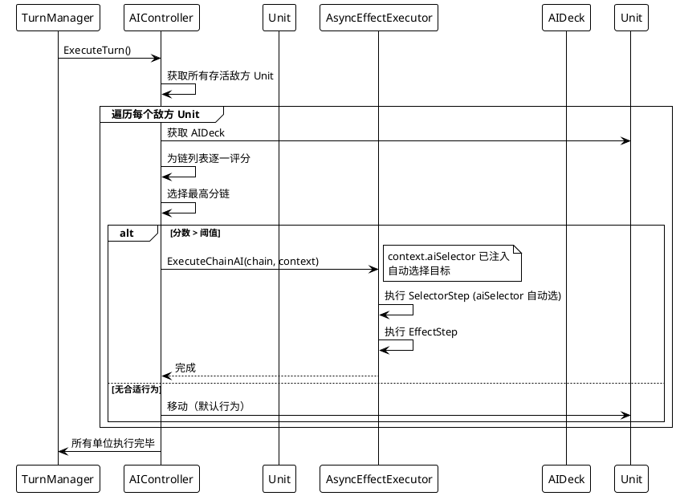

# AI 系统 设计文档

> 最后更新：2026-06-15 | 作者：WoodenLove

## 一、子系统概述

- **职责**：敌方回合的决策与行动执行，包括行为评分排序、自动目标选择、技能链执行
- **不负责**：玩家输入处理、牌库管理、回合流程控制
- **依赖模块**：效果链引擎（aiSelector 模式复用 EffectChain）、单位系统（操作目标）、回合管理（Enemy 阶段驱动）

## 二、核心类/数据结构

### 2.1 类关系

```
AIDeck (ScriptableObject)
  ├─ energyPerTurn           每回合能量
  ├─ strategy                策略类型（攻击型/防御型）
  └─ chainEntries            候选行为列表

AIChainEntry
  ├─ chains                  效果链（复用 EffectChain）
  ├─ baseScore               基础分
  ├─ cooldown                冷却回合
  ├─ remainingCooldown       剩余冷却
  ├─ minRange / maxRange     目标距离范围
  └─ aiTargetType            目标选择策略

AIController (MonoBehaviour)
  ├─ ExecuteTurn() → 遍历所有敌方 Unit
  ├─ ScoreChains(unit) → 为候选链评分
  └─ ExecuteBestChain(unit) → 执行最优链
```

### 2.2 评分因素

| 因素 | 说明 | 影响方向 |
|------|------|---------|
| `baseScore` | 行为基础分 | 越高越优先 |
| 距离 | 越靠近目标分数越高 | 正相关 |
| 自身血量 | 防御型 AI 更重视生存 | 低血量时逃跑倾向↑ |
| 目标血量 | 攻击型 AI 偏好可击杀目标 | 可斩杀时加分 |
| 能量效率 | 消耗 vs 每回合能量 | 性价比↑ |
| 冷却 | 冷却中行为受惩罚 | 冷却中↓ |
| 逃跑评分 | 低血量时远离敌人、靠近友军 | 防御型↑ |

## 三、关键流程时序图



## 四、状态机/算法说明

### 4.1 AI 评分算法

```csharp
float ScoreEntry(AIChainEntry entry, Unit self)
{
    float score = entry.baseScore;

    // 冷却惩罚
    if (entry.remainingCooldown > 0)
        score *= 0.1f;

    // 距离因子
    float distanceScore = EvaluateDistance(entry, self);
    score += distanceScore;

    // 血量因子（防御型 AI）
    if (deck.strategy == Strategy.Defensive)
    {
        float hpPercent = self.HpPercent;
        if (hpPercent < 0.3f) score -= 50;  // 逃跑倾向
    }

    // 目标血量因子（攻击型 AI）
    if (deck.strategy == Strategy.Aggressive)
    {
        // 偏好可击杀目标
        score += EvaluateKillPotential(entry, self);
    }

    return score;
}
```

## 五、配置表详细规范

### 5.1 AIDeck

| 字段 | 类型 | 含义 |
|------|------|------|
| `energyPerTurn` | `int` | 每回合能量 |
| `strategy` | `AITargetType` | 策略类型 |
| `chainEntries` | `List<AIChainEntry>` | 候选行为列表 |

### 5.2 AIChainEntry

| 字段 | 类型 | 含义 | 备注 |
|------|------|------|------|
| `chains` | `List<EffectChain>` | 效果链 | 复用卡牌效果链 |
| `baseScore` | `int` | 基础分 | 越高越优先 |
| `cooldown` | `int` | 冷却回合 | 0=无冷却 |
| `minRange` | `int` | 最小距离 | |
| `maxRange` | `int` | 最大距离 | |
| `aiTargetType` | `AITargetType` | 目标策略 | Self/Enemy/Ally/Position |

## 六、错误处理与边界条件

- **无可用行为**：单位执行默认移动（靠近最近敌人）
- **所有目标死亡**：跳过该单位 AI
- **效果链执行异常**：`chainBroken=true` 时跳过，不影响其他单位
- **AIController 执行中玩家退出**：当前轮执行完毕后响应

## 七、性能注意事项

- **评分计算**：每回合每个单位执行一次，数量可控（典型 ≤ 20 个敌方单位）
- **协程驱动**：AI 效果链使用 `ExecuteChainAI` 协程，不阻塞主线程

## 八、测试要点 & 已知坑

- **手动测试**：配置不同策略类型的 AIDeck，验证行为倾向
- **边界测试**：无 AIDeck 的单位、全冷却中的行为列表、全不可达目标
