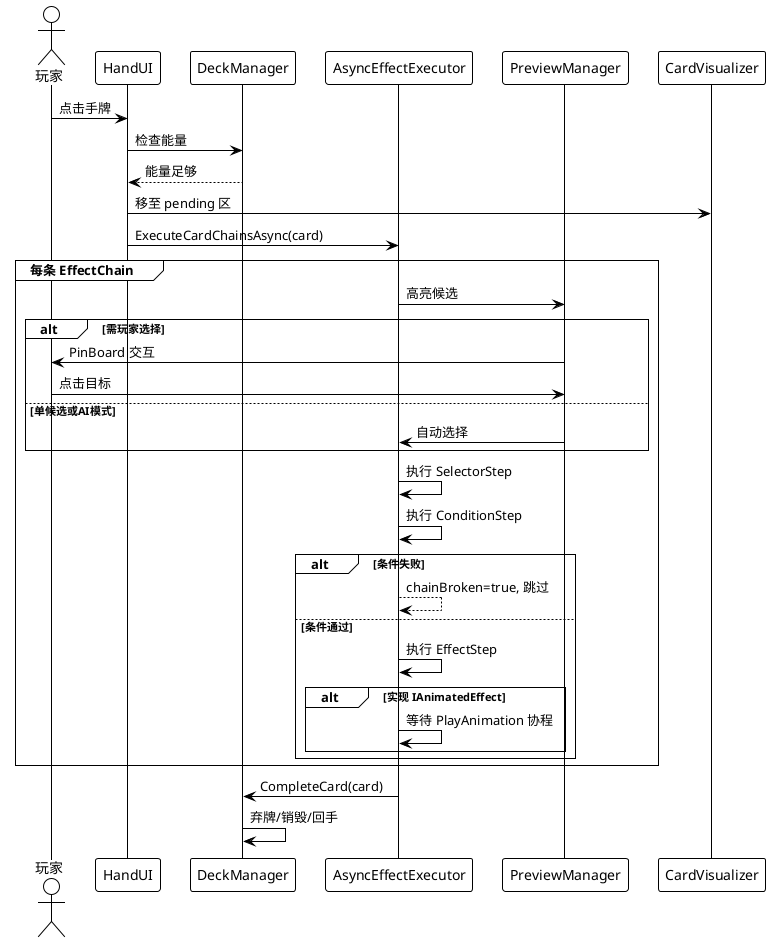
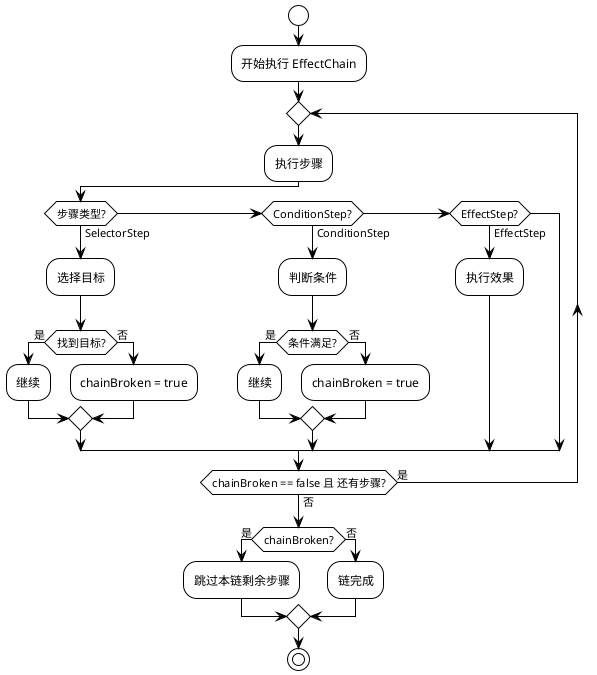

# 卡牌系统 设计文档

> 最后更新：2026-06-16 | 作者：WoodenLove

## 一、子系统概述

- **职责**：从玩家点牌到效果执行完毕的完整链路，涵盖手牌交互、牌库管理、效果链异步执行
- **不负责**：AI 自动出牌、回合流程控制、单位属性修改
- **依赖模块**：事件总线（输入/卡牌事件）、回合管理（PlayerPlay阶段驱动）、单位系统（效果操作目标）

## 二、核心类/数据结构

### 2.1 卡牌数据（`CardData`）

```csharp
[CreateAssetMenu(fileName = "CardData", menuName = "CardChess/Cards/CardData")]
public class CardData : ScriptableObject
{
    public string cardName;
    public Sprite artwork;
    public string description;
    public DestinationOnPlay destination;  // Discard / Destroy / ReturnToHand
    public int Cost;
    public bool retain;
    public CardColorPreset colorPreset;
    public Color cardColor;
    public List<EffectChain> chains;        // 多条效果链
}
```

### 2.2 效果链结构

```
EffectChain（可序列化类）
  └─ List<ChainStep> steps         ← [SerializeReference] 多态序列化
       ├─ SelectorStep             选择目标
       │    └─ TargetSelector（SO）   ──→  List<ITarget>
       ├─ ConditionStep            判断条件
       │    └─ Condition（SO）
       └─ EffectStep               执行效果
            └─ Effect（SO）          ──→  IAnimatedEffect（可选）
```

### 2.3 执行上下文（`EffectContext`）

| 字段 | 类型 | 说明 |
|------|------|------|
| `sourceCard` | `CardData` | 来源卡牌 |
| `executor` | `ITarget` | 当前步骤执行者（上一个步骤的被执行者） |
| `executed` | `ITarget` | 当前步骤被执行者 |
| `cachedPath` | `List<Vector2Int>` | 选择器到效果间传递的路径缓存 |
| `aiSelector` | `Func<List<ITarget>, ITarget>` | AI 模式自动选择委托（null=玩家模式） |
| `chainBroken` | `bool` | 链中断标志 |

## 三、关键流程时序图

### 3.1 出牌完整流程



### 3.2 链中断流程



## 四、状态机/算法说明

### 效果链执行算法

`AsyncEffectExecutor.ExecuteCardChainsAsync(card)` 的核心逻辑：

1. 创建初始 `EffectContext`，`executor = executed = CardTarget(card)`
2. 遍历 `card.chains`，每条链独立创建 `EffectContext` 副本
3. 遍历链中每个 `ChainStep`：
   - **SelectorStep**：执行选择器 → 获取 `List<ITarget>` → 单候选自动确认 / 多候选交给 `PreviewManager`
   - **ConditionStep**：判断条件 → 失败则 `chainBroken=true`
   - **EffectStep**：调用 `effect.OnExecute(ctx)` → 若实现 `IAnimatedEffect` 则 `yield return PlayAnimation(ctx)` → `OnComplete(ctx)`
4. `executor ← executed ← 目标` 链式传递
5. 所有链完成后调用 `DeckManager.CompleteCard(card)`

### PinBoard 目标选择状态

```
PreviewManager: Idle → Selecting → Preselected → Confirmed / Cancelled
```

- **Idle**：无选择操作
- **Selecting**：多个候选高亮，等待玩家点击
- **Preselected**：已钉选一个目标，可继续选择或确认
- **Confirmed**：选择完成，回调 `AsyncEffectExecutor`
- **Cancelled**：右键/ESC 撤回

## 五、配置表详细规范

### 5.1 CardData

| 字段 | 类型 | 含义 | 取值范围 | 备注 |
|------|------|------|---------|------|
| `cardName` | `string` | 卡牌名称 | 任意 | 用于显示 |
| `artwork` | `Sprite` | 卡牌插图 | 任意 Sprite | |
| `description` | `string` | 卡牌描述 | 任意文本 | |
| `Cost` | `int` | 能量消耗 | ≥ 0 | |
| `destination` | `DestinationOnPlay` | 打出后去向 | Discard/Destroy/ReturnToHand | |
| `retain` | `bool` | 回合结束是否保留 | true/false | |
| `colorPreset` | `CardColorPreset` | 颜色预设 | None/Red/Green/Blue | |
| `chains` | `List<EffectChain>` | 效果链列表 | 至少1条 | 每条链独立执行 |

### 5.2 EffectChain

| 字段 | 类型 | 含义 | 备注 |
|------|------|------|------|
| `steps` | `List<ChainStep>` | 步骤序列 | `[SerializeReference]` 多态 |

### 5.3 内置效果

| 效果 | 类型 | 参数 | 说明 |
|------|------|------|------|
| `DamageEffect` | 物理/魔法 | `Multiplier` 倍率 + `Modifier` 修饰器 + `DamageType` | 支持背刺方位检测 |
| `MoveEffect` | 移动 | 目标位置 | 位移单位 |
| `HealEffect` | 治疗 | 治疗量 | 回复生命 |
| `SwapEffect` | 交换 | 目标单位 | 交换两个单位位置 |
| `AddBuffEffect` | 添加Buff | Buff 引用 | 为目标添加Buff |
| `GiveMovePointEffect` | 增加移动点 | 移动点数 | — |
| `SelfDamageEffect` | 自伤 | 伤害量 | 对自己造成伤害 |

### 5.4 内置选择器

| 选择器 | 返回目标类型 | 说明 |
|--------|------------|------|
| `UnitSelector` | `UnitTarget` | 选择指定单位 |
| `UnitSelectorAny` | `UnitTarget` | 选择任意单位 |
| `UnitSelectorBySource` | `UnitTarget` | 根据来源选择单位 |
| `UnitSelectorAnyBySource` | `UnitTarget` | 根据来源选择任意单位 |
| `CellAreaSelector` | `CellTarget` | 选择区域格子 |
| `CellPathSelector` | `CellTarget` | 沿路径选择格子 |

### 5.5 内置条件

| 条件 | 说明 |
|------|------|
| `ExecutedIsDeadCondition` | 检查被执行者是否已死亡 |

## 六、错误处理与边界条件

- **能量不足**：`DeckManager` 检查能量 → 不足时拒绝出牌并提示
- **无合法目标**：`SelectorStep` 返回空列表 → `chainBroken=true` → 跳过本链，不影响下一条链
- **执行中取消**：玩家可右键/ESC 撤回 PinBoard 选择，但不可中断已开始的效果动画
- **目标在动画执行中死亡**：`OnExecute` 时检查 `Unit.IsAlive`，死亡单位跳过效果
- **空链/空步骤**：`AsyncEffectExecutor` 跳过 null 链和 null 步骤

## 七、性能注意事项

- **CardVisualizer 对象池**：手牌卡牌视觉实例使用对象池管理，避免频繁 Instantiate/Destroy
- **协程而非 Update**：`AsyncEffectExecutor` 使用协程驱动效果链，避免每帧轮询
- **PreviewManager 高亮**：高亮材质切换只发生在候选变更时，不每帧更新
- **效果链不宜过长**：单张卡牌建议 ≤ 5 条链，每条链 ≤ 10 步，避免执行时间过长

## 八、测试要点 & 已知坑

- **手动测试**：创建测试卡牌覆盖单候选/多候选、链中断、IAnimatedEffect 三种路径
- **已知 Bug**：`Unit.GetAttackPositionFromTarget()` 中 Down 朝向下 Front/Back 判定反转，影响背刺 Buff
- **TODO**：`TestAnimatedDelayEffect` 为占位效果，开发阶段应替换为真实效果
- **注意**：`EffectChain.steps` 使用 `[SerializeReference]`，复制/粘贴步骤时 Unity Inspector 可能丢失引用，需重新选择
