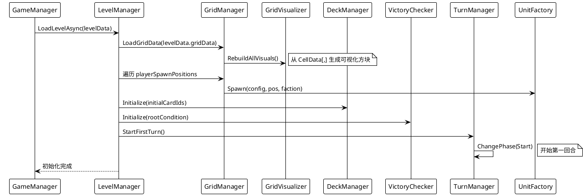
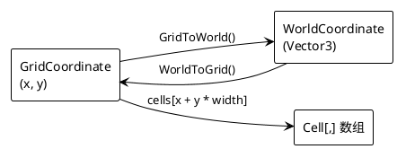

# 关卡系统 设计文档

> 最后更新：2026-06-15 | 作者：WoodenLove

## 一、子系统概述

- **职责**：关卡初始化编排（网格/回合/单位/牌库/胜利条件）、棋盘逻辑与可视化、路径渲染
- **不负责**：单位部署细节、卡牌逻辑、回合状态推进
- **依赖模块**：事件总线、回合管理（启动第一回合）、单位系统（部署/注册单位）、胜利判断（初始化条件）

## 二、核心类/数据结构

### 2.1 关卡数据资产

```
LevelData (ScriptableObject)
  ├─ LevelGridData (ScriptableObject)   棋盘地形
  ├─ LevelTurnData (ScriptableObject)   回合预设行动
  ├─ playerSpawnPositions               玩家出生点
  ├─ goalPositions                      目标点
  └─ rootCondition                      胜利条件树根节点

LevelGridData
  ├─ width, height                      网格尺寸
  └─ CellData[]                          一维数组 x + y * width

CellData
  └─ terrainType, isWalkable, moveCost

LevelTurnData
  └─ List<TurnAction>                   本回合行动列表
```

### 2.2 棋盘运行时

```
GridManager (MonoBehaviour singleton)
  ├─ LoadGridData(LevelGridData)        加载棋盘
  ├─ WorldToGrid() / GridToWorld()      坐标转换
  ├─ FindPath(start, end) → List<Vector2Int>   BFS 寻路
  ├─ GetReachableCells(start, maxSteps)  可达区域
  ├─ PlaceUnit(unit, pos)               放置单位
  └─ Cell[,]                             二维网格

Cell
  ├─ GridPosition, WorldPosition
  ├─ TerrainType, IsWalkable, MoveCost
  ├─ OccupiedUnit                        占用单位
  └─ IsOccupied

GridVisualizer (MonoBehaviour singleton)
  ├─ RebuildAllVisuals()                重建网格视觉
  ├─ HighlightPositions()               高亮格子
  └─ ClearHighlights()                  清除高亮

PathRenderer
  └─ 对象池管理路径视觉精灵
```

### 2.3 关卡协调

```
LevelManager (MonoBehaviour)
  ├─ Initialize(levelData, initialCards)
  │    ├─ GridManager.LoadGridData()
  │    ├─ GridVisualizer.RebuildAllVisuals()
  │    ├─ 部署玩家单位
  │    ├─ DeckManager 初始化牌库
  │    └─ VictoryChecker.Initialize()
  ├─ RegisterUnit(unit)                 注册单位
  ├─ HandleUnitDeath(unit)              处理单位死亡
  └─ LevelData 引用
```

## 三、关键流程时序图

### 3.1 关卡初始化流程



### 3.2 坐标转换



## 四、状态机/算法说明

### 4.1 BFS 寻路算法

`GridManager.FindPath(start, end)`：

1. 起点入队，标记访问
2. 四方向（上/下/左/右）扩展邻居
3. 跳过不可行走格子、越界格子、已占用格子
4. 到达终点时回溯路径
5. 不可达返回空列表

`GridManager.GetReachableCells(start, maxSteps)`：

1. 同 BFS，但记录步数
2. 步数 ≤ maxSteps 的格子均加入结果
3. 跳过已占用格子（除非是终点）

## 五、配置表详细规范

### 5.1 CellData

| 字段 | 类型 | 含义 | 取值范围 |
|------|------|------|---------|
| `terrainType` | `TerrainType` | 地形类型 | 枚举值 |
| `isWalkable` | `bool` | 是否可行走 | true/false |
| `moveCost` | `int` | 移动消耗 | ≥ 1 |

### 5.2 LevelGridData

| 字段 | 类型 | 含义 |
|------|------|------|
| `width` | `int` | 棋盘宽（列数） |
| `height` | `int` | 棋盘高（行数） |
| `cells` | `CellData[]` | 一维数组 |

### 5.3 TerrainType 枚举

| 值 | 说明 |
|------|------|
| `Plain` | 平地，可行走 |
| `Obstacle` | 障碍，不可行走 |
| `Water` | 水域，可行走但消耗高 |

## 六、错误处理与边界条件

- **FindPath 不可达**：返回空列表，调用方自行处理（如移动效果跳过）
- **PlaceUnit 格子已占用**：覆盖前先检查 `Cell.IsOccupied`
- **坐标越界**：`WorldToGrid` 返回 null，调用方检查
- **关卡数据缺失**：`LevelManager.Initialize` 中对每个数据资产做 null 检查
- **Tilemap 提取后注册 Addressables**：确保提取后的资产已正确注册到 Addressables 系统

## 七、性能注意事项

- **GridVisualizer 方块**：每个格子一个独立 Cube，大关卡（50×50）可能导致 2500 个物体，考虑合批或 Mesh 实例化
- **PathRenderer 对象池**：路径精灵使用对象池，避免高频 Instantiate
- **BFS 寻路**：每次寻路独立分配 visited 数组，大棋盘可考虑复用

## 八、测试要点 & 已知坑

- **手动测试**：创建不同地形布局的关卡，验证寻路和可达区域
- **边界测试**：1×1 棋盘、满障碍棋盘、占满单位的棋盘
- **TODO**：`EffectApplyAction` 当前直接应用单个效果，后续可改为完整效果链
