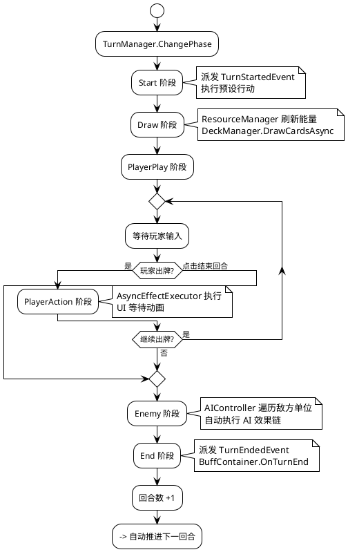
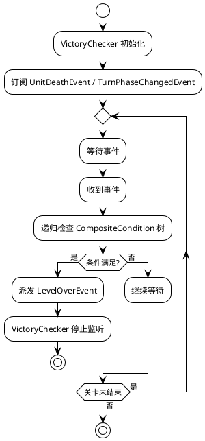
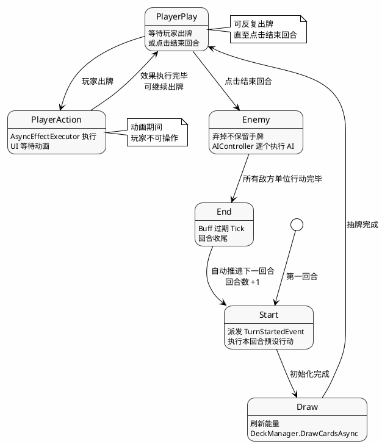

# 回合战斗系统 设计文档

> 最后更新：2026-06-16 | 作者：WoodenLove

## 一、子系统概述

- **职责**：管理回合状态机推进、阶段事件派发、回合预设行动执行、胜负条件判定
- **不负责**：卡牌效果具体执行、AI 决策逻辑、单位属性修改
- **依赖模块**：事件总线（阶段事件）、卡牌系统（PlayerPlay/Action 阶段）、AI 系统（Enemy 阶段）、棋盘系统（预设行动操作格子）

## 二、核心类/数据结构

### 2.1 回合状态接口

```
IState（接口）
  └─ ITurnState（接口，继承 IState）
       └─ 具体状态实现（TurnManager 内部类）
```

### 2.2 回合阶段枚举

| 阶段 | 触发事件 | 说明 |
|------|---------|------|
| **Start** | `TurnStartedEvent` | 派发回合开始事件，执行本回合预设行动（刷怪/改地形/应用效果） |
| **Draw** | `TurnPhaseChangedEvent` | 刷新能量、抽牌 |
| **PlayerPlay** | `TurnPhaseChangedEvent` | 等待玩家出牌或点击结束回合 |
| **PlayerAction** | `TurnPhaseChangedEvent` | 卡牌效果链执行中，UI 等待动画 |
| **Enemy** | `TurnPhaseChangedEvent` | 弃掉不保留手牌，逐个执行 AI 行动 |
| **End** | `TurnEndedEvent` | 回合收尾，自动开启下一回合 |

### 2.3 回合预设行动

| 行动类 | 说明 |
|--------|------|
| `SpawnUnitAction` | 在指定格子生成单位，支持 SpawnGroup 和搜索半径 |
| `CellChangeAction` | 修改格子地形、高度或可行走属性 |
| `EffectApplyAction` | 在指定格子应用效果 |

### 2.4 胜利条件体系

```
VictoryCondition（抽象类）
  ├─ KillAllEnemiesCondition    全歼敌人
  ├─ SurviveRoundsCondition     坚守回合
  ├─ ProtectUnitCondition       保护单位
  └─ ReachGoalCondition         到达目标点

CompositeCondition              AND / OR 组合
  ├─ LogicOperator.And
  └─ LogicOperator.Or

VictoryChecker（MonoBehaviour）    运行时监听器
  ├─ 监听 UnitDeathEvent
  ├─ 监听 TurnPhaseChangedEvent
  └─ 条件满足时派发 LevelOverEvent
```

## 三、关键流程时序图

### 3.1 回合状态机



### 3.2 胜利判定流程



## 四、状态机/算法说明

### 4.1 回合状态机状态流转



### 4.2 条件组合树评估

`VictoryChecker` 递归评估 `CompositeCondition`：

```csharp
bool Evaluate(VictoryCondition condition)
{
    if (condition is CompositeCondition composite)
    {
        var results = composite.children.Select(Evaluate);
        return composite.logicOperator == LogicOperator.And
            ? results.All(r => r)
            : results.Any(r => r);
    }
    return condition.IsMet();  // 叶子条件
}
```

## 五、配置表详细规范

### 5.1 LevelTurnData

| 字段 | 类型 | 含义 | 备注 |
|------|------|------|------|
| `turnNumber` | `int` | 回合编号 | 从 1 开始 |
| `actions` | `List<TurnAction>` | 本回合预设行动列表 | 在 Start 阶段按顺序执行 |

### 5.2 TurnAction

| 类型 | 关键参数 | 说明 |
|------|---------|------|
| `SpawnUnitAction` | `spawnGroup`, `position`, `searchRadius` | 在指定位置生成单位 |
| `CellChangeAction` | `position`, `newTerrainType`, `walkable` | 修改格子属性 |
| `EffectApplyAction` | `position`, `effect` | 在格子应用效果 |

### 5.3 VictoryCondition 配置

| 条件类型 | 参数 | 说明 |
|---------|------|------|
| `KillAllEnemiesCondition` | 无 | 全歼所有敌方单位 |
| `SurviveRoundsCondition` | `targetRounds` | 存活指定回合数 |
| `ProtectUnitCondition` | `targetUnitId` | 保护指定单位存活 |
| `ReachGoalCondition` | `goalPositions` | 单位到达目标点 |
| `CompositeCondition` | `logicOperator`, `children` | AND/OR 组合子条件 |

## 六、错误处理与边界条件

- **Start 阶段预设行动失败**：`TurnActionExecutor.ExecuteAll` 逐条执行，单条失败不影响后续行动
- **PlayerPlay 阶段无手牌**：自动显示"无手牌"提示，玩家只能点击结束回合
- **Enemy 阶段无敌人**：跳过该阶段直接进入 End
- **多个胜利条件同时满足**：按条件树优先级，先评估先触发
- **VictoryChecker 在关卡结算后停止监听**：防止关卡结束后误触发

## 七、性能注意事项

- **TurnActionExecutor**：预设行动执行不频繁（每回合一次），无性能瓶颈
- **VictoryChecker**：只监听事件，不每帧轮询；条件树评估时间与条件数量成正比，建议树深度 ≤ 5 层
- **回合状态切换**：纯状态机逻辑，零分配

## 八、测试要点 & 已知坑

- **手动测试**：创建多回合测试关卡，验证每阶段事件派发正确性
- **边界测试**：0 回合关卡、单回合内多次出牌、空手牌结束回合
- **已知 Bug**：`Unit.GetAttackPositionFromTarget()` Down 朝向下方位判定反转
- **TODO**：`ContinueGame()`、`GameOver()` 等流程仍有待补全
