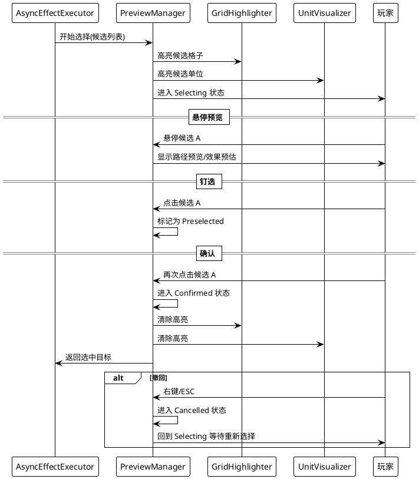

# UI 与交互系统 设计文档

> 最后更新：2026-06-15 | 作者：WoodenLove

## 一、子系统概述

- **职责**：输入事件转换、面板管理、手牌 UI、PinBoard 目标选择、格子/单位高亮、伤害浮字、粒子特效
- **不负责**：游戏逻辑、回合状态推进、效果执行
- **依赖模块**：事件总线（派发/监听输入事件）、效果链系统（PreviewManager 协作）、单位系统（显示信息）

## 二、核心类/数据结构

### 2.1 输入管理

```
InputManager (MonoBehaviour)
  ├─ 使用 New Input System
  ├─ 单击/双击/右键/ESC → 派发对应 InputEvent
  └─ 长按 → LongPressInfoDetector 协同

ILongPressTarget (interface)
  └─ GetScreenPosition(), OnLongPressStart/Update/Cancel/Performed

LongPressInfoDetector (MonoBehaviour)
  └─ 检测鼠标/触摸长按 → 派发 LongPressEvent
```

### 2.2 UI 管理

```
UIManager (MonoBehaviour singleton)
  ├─ PushPanel(), PopPanel()            面板栈管理
  ├─ ShowPanel(), HidePanel()           显隐控制
  ├─ 遮罩转场 (MaskRadiusAnimator)
  └─ 层级栈 → AnimatedPanel

HandUI (MonoBehaviour)
  ├─ 手牌卡牌对象池
  ├─ 抽牌动画、弃牌动画、pending 区动画
  ├─ 费用颜色、能量数字滚动
  └─ 与 CardVisualizer 协作
```

### 2.3 预览交互

```
PreviewManager (MonoBehaviour)
  ├─ 状态: Idle → Selecting → Preselected → Confirmed/Cancelled
  ├─ 高亮候选目标 (单位/格子)
  ├─ 悬停预览 → 路径/效果预估
  ├─ PinBoard 钉选 → 撤回确认
  └─ 分阶段处理多选择器

GridHighlighter (MonoBehaviour)
  └─ 格子高亮效果

UnitVisualizer (MonoBehaviour singleton)
  ├─ HighlightUnits() / ClearHighlights()
  ├─ 2D: 切换 Sorting Layer
  └─ 3D: 替换材质
```

### 2.4 视觉辅助

```
FloatingNumberManager (MonoBehaviour)
  └─ ShowNumber(position, value, type)  伤害/治疗浮字

FloatingNumber (MonoBehaviour)
  └─ 浮动 + 渐隐动画

ParticleManager (MonoBehaviour)
  └─ PlayEffect(position, effectType)
```

## 三、关键流程时序图

### 3.1 PinBoard 目标选择



## 四、状态机/算法说明

### 4.1 PreviewManager 状态机

```
         ┌──────────┐
         │   Idle   │
         └────┬─────┘
              │ 收到选择请求
              ▼
      ┌───────────────┐
      │   Selecting    │ ←─── 右键/ESC ───┐
      └───────┬───────┘                   │
              │ 首次点击候选              │
              ▼                           │
      ┌───────────────┐                   │
      │  Preselected  │───────────────────┘
      └───────┬───────┘
              │ 再次点击 / 满足数量
              ▼
      ┌───────────────┐
      │   Confirmed   │
      └───────┬───────┘
              │ 回调 AsyncEffectExecutor
              ▼
         ┌──────────┐
         │   Idle   │
         └──────────┘
```

## 五、配置表详细规范

### 5.1 输入事件映射

| 输入 | 事件 | 目标类型 |
|------|------|---------|
| 鼠标左键单击 | `CellLeftClickedEvent` / `UnitLeftClickedEvent` | 格子/单位 |
| 鼠标左键双击 | `CellDoubleClickedEvent` / `UnitDoubleClickedEvent` | 格子/单位 |
| 鼠标右键 | `CellRightClickedEvent` / `EscapePressedEvent` | 格子/全局 |
| ESC | `EscapePressedEvent` | 全局 |
| 长按 | `LongPressStartedEvent` / `LongPressUpdateEvent` / `LongPressCancelledEvent` / `LongPressPerformedEvent` | 单位 |

### 5.2 UI 面板列表

| 面板 | 场景 | 说明 |
|------|------|------|
| `MainMenuUI` | MainMenu | 主菜单 |
| `MapUITemp` | Map | 地图界面 |
| `HUD_UI` | 关卡场景 | 战斗 HUD |
| `PauseMenuUI` | 关卡场景 | 暂停菜单 |
| `SettingsUI` | 全局 | 设置面板 |
| `LoadingScreen` | 全局 | 加载画面 |
| `UnitInfoPanel` | 关卡场景 | 单位详情 |

## 六、错误处理与边界条件

- **PinBoard 选择超时**：暂无超时机制，玩家必须完成选择或撤回
- **右键与 ESC 冲突**：两事件均派发，由监听方自行决定响应
- **面板栈空**：`UIManager.PopPanel()` 检查栈空，空时忽略

## 七、性能注意事项

- **HandUI 对象池**：手牌卡牌实例使用对象池，避免频繁 Instantiate/Destroy
- **UnitVisualizer 材质替换**：只在高亮状态变化时操作材质，不每帧更新
- **FloatingNumber 对象池**：浮字实例可复用，避免重复创建

## 八、测试要点 & 已知坑

- **手动测试**：验证所有输入映射的正确性（单击/双击/右键/ESC/长按）
- **边界测试**：面板栈的反复 Push/Pop、空手牌时的 HandUI 状态
- **TODO**：UI 中背包、图鉴等入口已有预留，功能内容待补充
