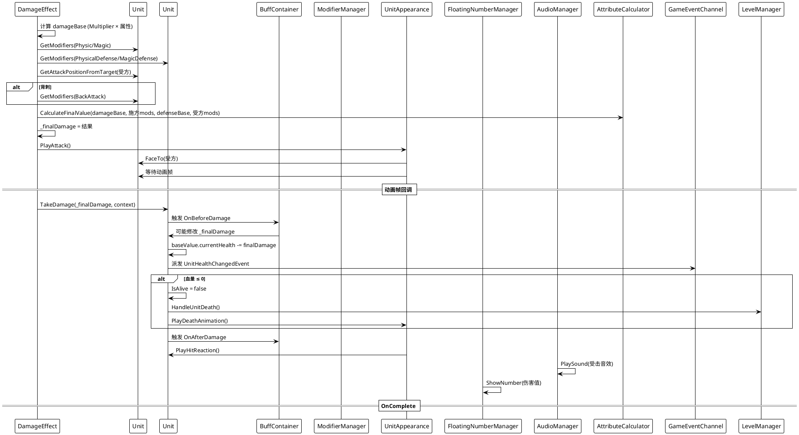
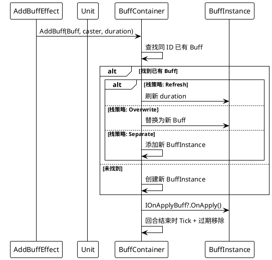

# 单位系统 设计文档

> 最后更新：2026-06-15 | 作者：WoodenLove

## 一、子系统概述

- **职责**：单位生命周期管理、属性/修饰器计算、Buff 管理、外观动画、视觉高亮
- **不负责**：AI 决策、网格管理、卡牌逻辑
- **依赖模块**：棋盘系统（位置/移动）、效果链系统（作为效果操作目标）、事件总线（属性变化/生死事件）

## 二、核心类/数据结构

### 2.1 核心属性

```csharp
[Serializable]
public struct UnitBaseValue
{
    public int currentHealth;
    public int maxHealth;
    public int attack;
    public int intelligence;
    public int physicalDefense;
    public int magicDefense;
    public int movePointLimit;
    public int movePoints;
    public int hasMoved;
}
```

### 2.2 类关系

```
UnitConfig (ScriptableObject)
  ├─ unitId, unitName, occupation, faction
  ├─ unitPrefab, icon
  ├─ initialValue (UnitBaseValue)
  ├─ innateBuffs (List<Buff>)
  └─ aiDeck (AIDeck)

UnitFactory (static)
  └─ Spawn(config, pos, faction) → Unit

Unit (MonoBehaviour, ILongPressTarget)
  ├─ baseValue (UnitBaseValue)
  ├─ modifierManager (ModifierManager)
  ├─ BuffContainer
  ├─ Appearance (UnitAppearance)
  ├─ GridPosition, FacingDirection
  ├─ 事件钩子: BeforeDamage / AfterDamage / Moved
  ├─ TakeDamage(), Heal(), MoveTo()
  ├─ GetDefenseFor(type), GetAttackPositionFromTarget()
  └─ Initialize(config, pos, faction)

ModifierManager
  ├─ 按 ModifierField 管理 Modifier 列表
  ├─ AddModifier(), RemoveModifier()
  └─ GetModifiers(field) → List<Modifier>

Modifier
  ├─ source (BuffInstance 引用)
  ├─ value (float)
  ├─ type (Add / Multiply / FinalAdd / FinalMultiply)
  └─ field (Physic / Magic / PhysicalDefense / MagicDefense / BackAttack ...)

AttributeCalculator (static)
  └─ CalculateFinalValue(base_or, modifiers_or, base_ed, modifiers_ed) → int

UnitAppearance (MonoBehaviour)
  ├─ PlayWalkAnimation(path), PlayAttack(damageType), PlayHitReaction()
  ├─ PlayDeathAnimation(), SetIdle()
  ├─ FaceTo(targetPos), SyncFacingDirection()
  └─ AnimationEventForwarder → OnAnimationFrame()

UnitVisualizer (MonoBehaviour singleton)
  ├─ HighlightUnits(), ClearHighlights()
  ├─ 2D: 切换 Sorting Layer
  └─ 3D: 替换材质
```

### 2.3 Buff 体系

```
Buff (abstract ScriptableObject)
  ├─ stackStrategy (Refresh / Overwrite / Separate)
  ├─ maxStack, duration
  └─ 可选实现接口:
       IOnApplyBuff / IOnRemoveBuff / IOnTurnStart / IOnTurnEnd
       IOnBeforeDmg / IOnAfterDmg / IOnMoveBuff / IOnGetMovePoint
       IAttackPositionModifier

BuffInstance (运行时实例)
  ├─ BuffData, Host, Caster
  ├─ RemainingDuration, CurrentStacks
  ├─ IsExpired
  ├─ AddModifier() → 自动追踪引用
  └─ AddStack(), RemoveStack()

BuffContainer
  ├─ 管理 List<BuffInstance>
  ├─ 三种栈策略: Refresh / Overwrite / Separate
  ├─ 事件转发: OnBeforeDamage → IOnBeforeDmg, 等
  ├─ OnTurnStarted(), OnTurnEnd()
  └─ ModifyAttackPosition(), ModifyHitPosition()
```

### 2.4 修饰器计算公式

```
finalDamage = (damageBase × 施方乘算 - defenseBase × 受方乘算) × 最终乘算 + 最终加算
```

其中：
- `damageBase` = 施方属性 × `Multiplier` 倍率（attack/intelligence/currentHealth 等）
- `defenseBase` = 受方防御值（physicalDefense / magicDefense）
- 施方/受方各自的 Add/Multiply/FinalAdd/FinalMultiply 独立计算

## 三、关键流程时序图

### 3.1 伤害流程



### 3.2 Buff 添加流程



## 四、状态机/算法说明

### 4.1 攻击方位判定算法

`Unit.GetAttackPositionFromTarget(executed)` 根据受击方朝向计算攻击方位：

```
diff = 施方位置 - 受方位置
x = diff.x, y = diff.y

受方面朝 Up:
  Back ← y + |x| < 0
  Front ← y >= |x|
  Side  ← 其余

受方面朝 Down:
  Back ← y > |x|
  Front ← y + |x| <= 0
  Side  ← 其余

受方面朝 Left:
  Back ← x > |y|
  Front ← x + |y| <= 0
  Side  ← 其余

受方面朝 Right:
  Back ← x + |y| < 0
  Front ← x >= |y|
  Side  ← 其余
```

> ⚠️ Down 朝向下 Front/Back 判定逻辑存在表达式错误，影响背刺 Buff 触发。

## 五、配置表详细规范

### 5.1 UnitConfig

| 字段 | 类型 | 含义 | 备注 |
|------|------|------|------|
| `unitId` | `string` | 单位 ID | 唯一标识 |
| `unitName` | `string` | 显示名称 | |
| `occupation` | `Occupation` | 职业枚举 | |
| `defaultFaction` | `Faction` | 默认阵营 | Enemy/Player/Neutral |
| `icon` | `Sprite` | 头像 | |
| `unitPrefab` | `GameObject` | 预制体 | 必须含 Unit 组件 |
| `aiDeck` | `AIDeck` | AI 牌组 | 敌方单位配置 |
| `initialValue` | `UnitBaseValue` | 初始属性 | |
| `innateBuffs` | `List<Buff>` | 先天 Buff | 生成时自动添加 |

### 5.2 UnitBaseValue 字段

| 字段 | 类型 | 含义 | 典型范围 |
|------|------|------|---------|
| `currentHealth` | `int` | 当前生命 | 0 ~ maxHealth |
| `maxHealth` | `int` | 生命上限 | 1 ~ 999 |
| `attack` | `int` | 攻击力 | 0 ~ 999 |
| `intelligence` | `int` | 智力 | 0 ~ 999 |
| `physicalDefense` | `int` | 物理防御 | 0 ~ 999 |
| `magicDefense` | `int` | 魔法防御 | 0 ~ 999 |
| `movePointLimit` | `int` | 移动力上限 | 0 ~ 20 |
| `movePoints` | `int` | 当前移动力 | 0 ~ movePointLimit |
| `hasMoved` | `int` | 已移动步数 | 0 ~ movePointLimit |

## 六、错误处理与边界条件

- **死亡单位操作**：`TakeDamage` 检查 `IsAlive`，已死亡单位跳过伤害
- **Buff 过期自动移除**：`OnTurnEnd` 中 `BuffInstance.Tick()` 标记过期，`BuffContainer` 移除
- **修饰器追踪**：`BuffInstance` 追踪 `AddModifier()` 添加的修饰器，Buff 移除时自动清理
- **UnitFactory.Spawn 异常**：config 或 prefab 为 null 时记录错误并返回 null

## 七、性能注意事项

- **ModifierManager**：修饰器按 `ModifierField` 分组存储，查询 O(1)，不每帧遍历
- **BuffContainer**：使用 `.ToList()` 安全遍历，防止回调中修改集合
- **UnitVisualizer**：高亮/悬停只在状态变化时触发，不每帧更新
- **UnitAppearance 动画**：使用 Animator + trigger，不每帧轮询

## 八、测试要点 & 已知坑

- **手动测试**：创建不同朝向的测试单位，验证 Front/Side/Back 判定
- **Buff 测试**：覆盖三种栈策略（Refresh/Overwrite/Separate），验证叠加/过期/移除
- **修饰器测试**：覆盖四种类型（Add/Multiply/FinalAdd/FinalMultiply）的组合
- **已知 Bug**：`GetAttackPositionFromTarget()` Down 朝向下 Front/Back 反转
- **TODO**：单位跨关血量、经验、升级等长期成长数据已有 `RunState` 字段，战斗结算逻辑待扩展
