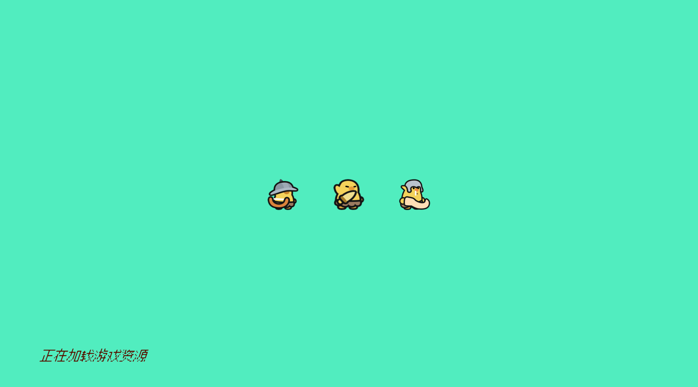
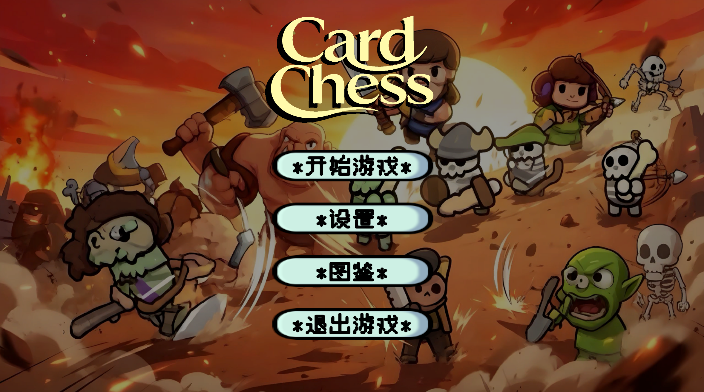
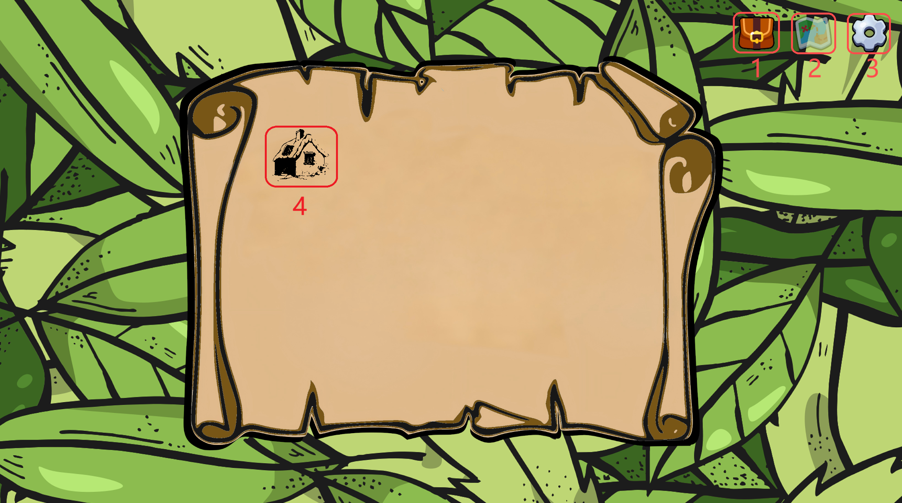
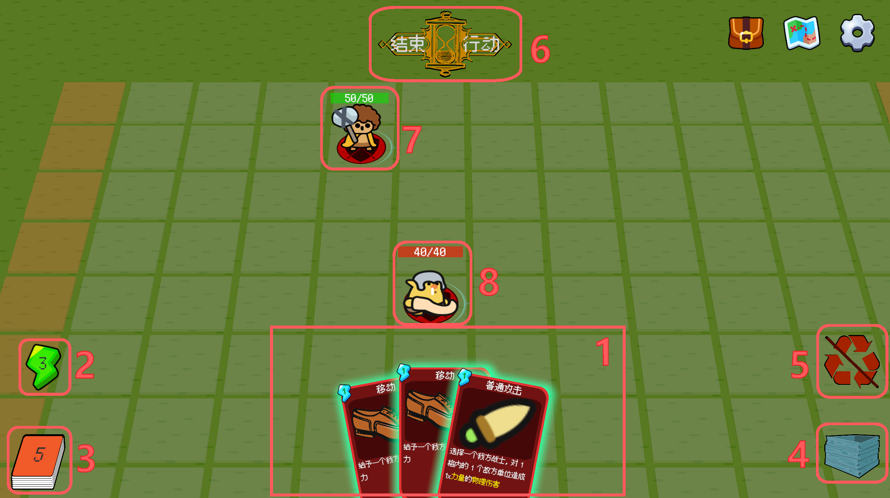
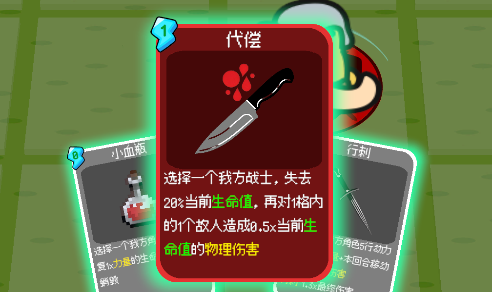
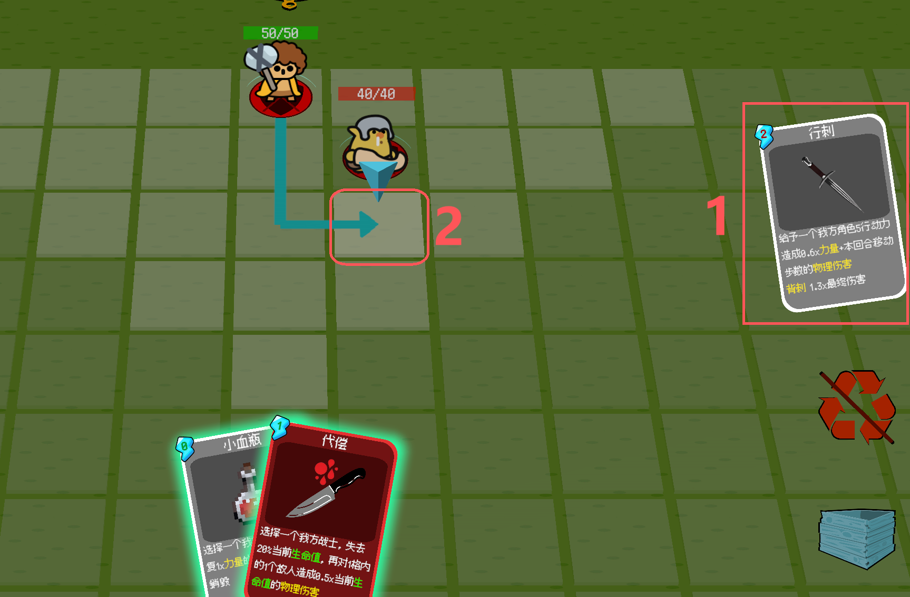
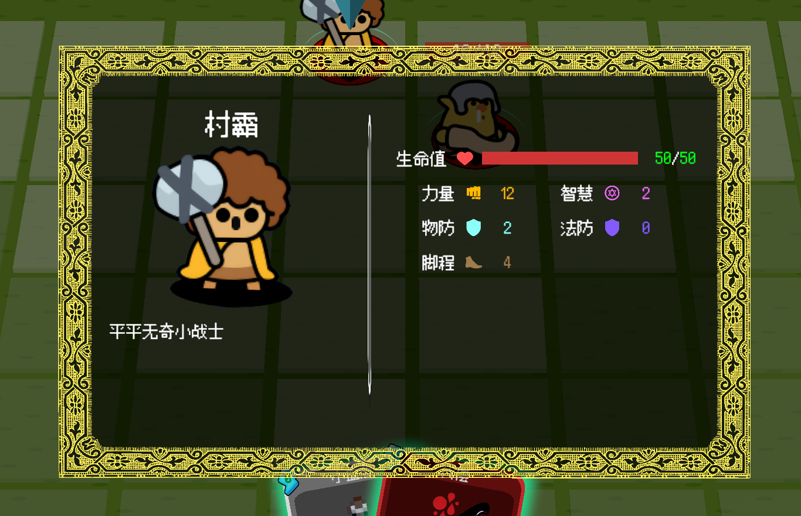
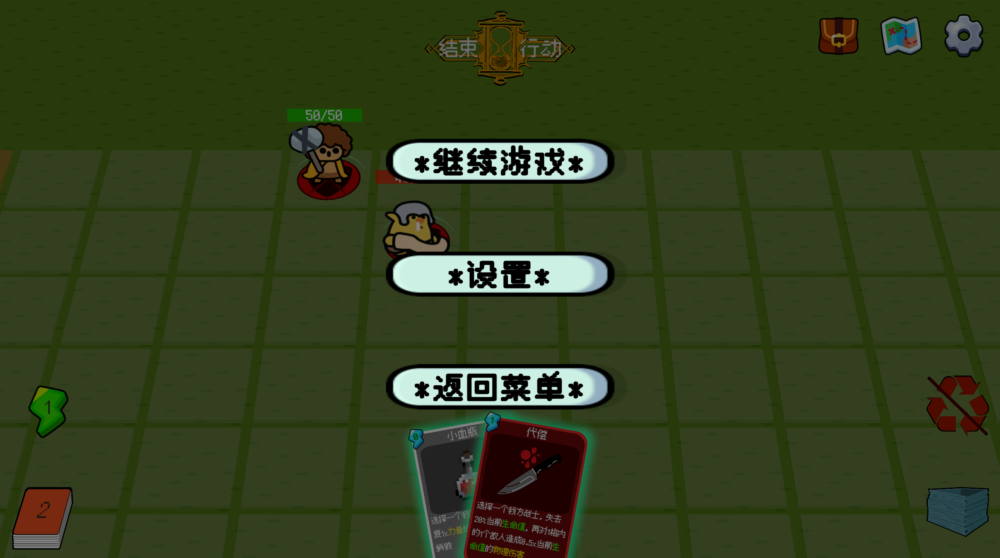
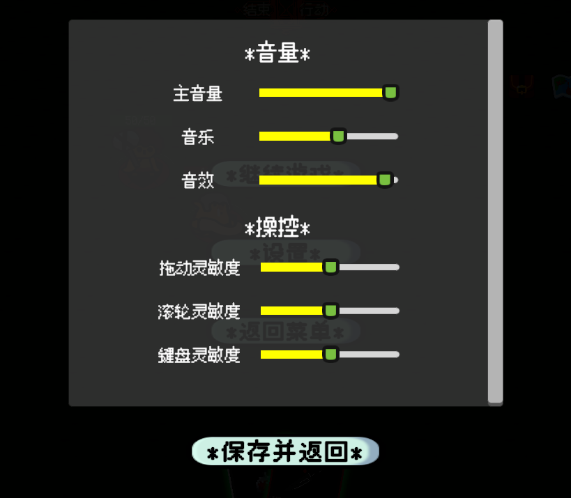

# 战牌（CardChess）用户手册

> 最后更新：2026-06-16 | 作者：WoodenLove

## 一、概述

**战牌（CardChess）** 是一款（拟打造成Roguelike的）回合制卡牌战棋策略游戏。您在棋盘关卡中操控己方单位，通过打出手牌触发移动、攻击、治疗、Buff 等效果，与敌方单位进行战斗。

本手册面向玩家，介绍如何开始游戏、基本操作、战斗规则和界面说明。

## 二、开始游戏

游戏从初始化场景启动，经历以下流程进入正式游戏：

```text
启动画面 → 主菜单 → 开始游戏 → 选关 → 进入战斗关卡
```

## 三、战斗基础

### 1. 回合流程

每场战斗按回合推进，每个回合包含以下阶段：

| 阶段 | 说明 |
|------|------|
| **开始阶段** | 执行本回合预设事件（如刷怪、地形变化） |
| **抽牌阶段** | 自动恢复能量并抽取手牌 |
| **出牌阶段** | 您可以使用手牌，指挥单位行动 |
| **效果阶段** | 卡牌效果链执行中，等待动画完成 |
| **敌方阶段** | 敌方单位按 AI 自动行动 |
| **结束阶段** | 回合收尾，自动进入下一回合 |

> 出牌阶段您可以反复出牌，直至点击"结束回合"按钮。

### 2. 胜利与失败

每个关卡设有胜利条件，常见的条件包括：

| 条件 | 说明 |
|------|------|
| **全歼敌人** | 击败所有敌方单位 |
| **坚守回合** | 存活到指定回合数 |
| **保护单位** | 指定单位不被击败 |
| **到达目标点** | 任意单位到达指定位置 |
| **组合条件** | 以上条件的 AND/OR 组合 |

满足任一胜利条件时关卡即告胜利；若我方全体单位被击败则失败。

## 四、操作指南

> ⚠当前不支持修改键位设置，以下为默认键鼠操作：

| 操作 | 功能 |
|------|------|
| **鼠标右键拖动/键盘WASD** | 移动视角 |
| **鼠标滚轮** | 缩放视角 |
| **鼠标悬停在卡牌上** | 手牌预览 |
| **鼠标左键点击卡牌** | 打出手牌 |
| **鼠标左键点击单位** | 选择单位作为目标 |
| **鼠标左键点击格子** | 选择格子作为目标或移动目标 |
| **长按单位** | 查看单位详细信息 |
| **ESC 键** | 关闭当前面板或撤回操作 |
| **结束回合按钮** | 结束出牌阶段，进入敌方回合 |
| **暂停按钮** | 暂停游戏并打开暂停菜单 |

### 目标选择

> 具体效果见`五、界面说明`

当一张卡牌有多个可选目标时，会进入**预选模式**：

1. 所有合法目标会高亮显示
2. **首次点击**目标将其预选中，会显示预览
3. **再次点击**已钉选的目标以确认
4. ⚠若只有一个可选目标，会**自动**选择

## 五、界面说明

### 0. 启动界面



### 1. 主菜单



- **开始游戏**：创建新游戏，进入地图场景
- **设置**：打开设置界面
- **图鉴**：打开图鉴界面（⚠暂未实现）
- **退出游戏**：关闭游戏程序

### 2. 地图场景

> 点击`开始游戏`进入



1. **背包**：显示当前持有的卡牌、资源等（暂未实现）
2. **地图**：局内地图显示按钮，此界面不生效
3. **设置**：调整选项/返回主菜单
4. **关卡图标**：点击进入对应关卡的战斗界面（⚠当前版本仅一关）

### 3. 战斗主界面

> 点击`关卡图标`进入



1. **手牌区**：显示当前可用的卡牌
2. **能量显示**：当前能量值
3. **抽牌堆**：剩余牌数（目前不支持点击查看）
4. **弃牌堆**：已使用的卡牌（⚠目前不支持点击查看）
5. **销毁堆**：被销毁的卡牌（⚠目前不支持点击查看）
6. **结束回合按钮**：结束出牌阶段，进入敌方回合
7. **玩家角色**：生命值显示为绿色
8. **敌方单位**：生命值显示为红色

- **棋盘**：显示战斗区域，单位和地形分布在此
- **键鼠操作**：参见 `四、操作指南`

### 4. 手牌区



- 手牌位于屏幕底部，显示您当前可用的卡牌
- 鼠标悬停在卡牌上时，对应卡牌会突出显示
- 每张卡牌显示：**名称**、**能量消耗**（左上角）、**图标**、**效果描述**
- 能量足够时卡牌边缘发光，能量显示为亮色
- 打出卡牌后，卡牌会飞向屏幕中央执行效果，然后进入弃牌堆/销毁堆或返回手牌

### 5. 效果执行



1. **待生效区**：卡牌打出后如果正常生效，则进入到右侧待执行区域，等待效果链执行完成，期间无法进行其他操作
2. **可选目标**：可以选择的目标会被高亮，点击后会显示相应的预览

### 6. 单位信息

> `长按单位`查看详细信息



- 详情可以参看术语表
- 点击空白位置关闭信息面板
- ⚠当前面板信息不支持同步更新，可能会在动态过程中查看到过时信息

### 7. 暂停菜单

> 点击右上角`设置`进入



- 进入时会暂停游戏
- **继续游戏**：关闭菜单，继续当前游戏
- **设置**：打开设置界面
- **返回主菜单**：回到主菜单界面（⚠当前对局进度不支持保存）

### 8. 设置界面

> 从任意界面点击`设置`进入

> [!NOTE] 提示
> 为展示所有选项，截图为异形屏下的适配效果，常用分辨率中是滑动窗口



- **音量**：调整主音量、音乐、音效
- **操控**：调整操作灵敏度（⚠当前不支持修改键位）
- 会自动保存并应用

## 六、术语表

| 术语 | 说明 |
|------|------|
| **手牌** | 您当前可使用的卡牌，位于屏幕底部 |
| **牌库** | 您的卡牌池，每回合抽取固定数量到手牌 |
| **弃牌堆** | 已使用卡牌的放置区 |
| **销毁堆** | 被销毁的卡牌放置区，不会通过洗牌回到抽牌区 |
| **移除** | 被移除的卡牌将被移出本局游戏|
| **能量** | 打出卡牌所需的资源，每回合自动恢复 |
| **Buff** | 单位身上的临时增益或减益效果 |
| **脚程** | 单位每次可获得的行动力上限 |
| **朝向** | 影响攻击方位判定（正面/侧面/背面），例如`背刺`效果 |

## 七、常见问题

**问题：如何开始新游戏？**
**解决：** 暂停游戏 → 返回主菜单 → 开始游戏。

**问题：为什么不能出牌？**
**解决：** 可能原因：①不在出牌阶段（等待抽牌或敌方行动完成）；②能量不足；③手牌为空。

**问题：如何结束我的回合？**
**解决：** 点击屏幕上方的"结束回合"按钮。

**问题：点击卡牌后没有反应？**
**解决：** 检查能量是否足够；如果卡牌需要选择目标，请点击场上高亮的单位或格子来确认目标。

**问题：如何查看单位的详细信息？**
**解决：** 在游戏中长按（按住鼠标左键不放）单位，会弹出示详细信息面板。

**问题：如何撤回操作？**
**解决：** 当前不支持撤回操作，卡牌打出后要求执行完成。

**问题：游戏卡住不动了？**
**解决：** 检查是否在敌方行动阶段（等待动画播放完毕）；如果是 Bug，请查看 Console 日志并反馈。

<!-- ## 八、相关文档

- [卡牌制作指南](卡牌制作指南.md) — 面向策划的卡牌配置说明
- [Unit制作指南](Unit制作指南.md) — 面向策划的单位配置说明
- [地图制作指南](地图制作指南.md) — 面向策划的关卡编辑说明
- [架构设计文档](../design/CardChess设计文档.md) — 开发架构总纲 -->
